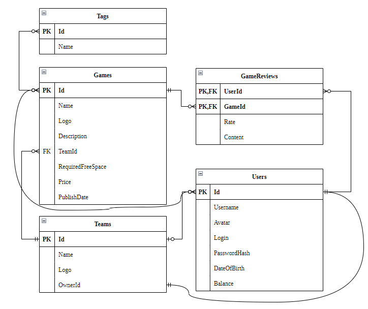
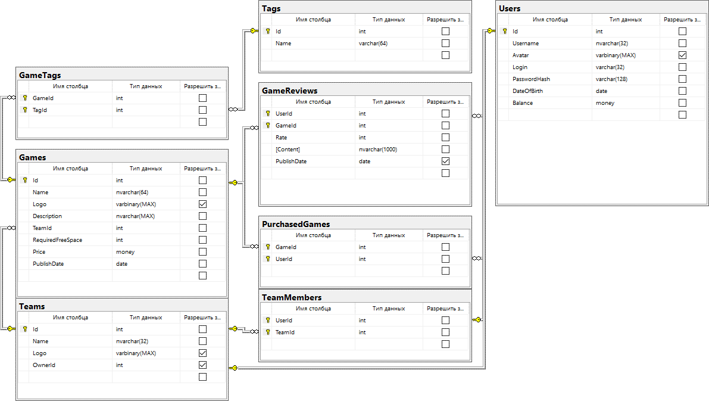
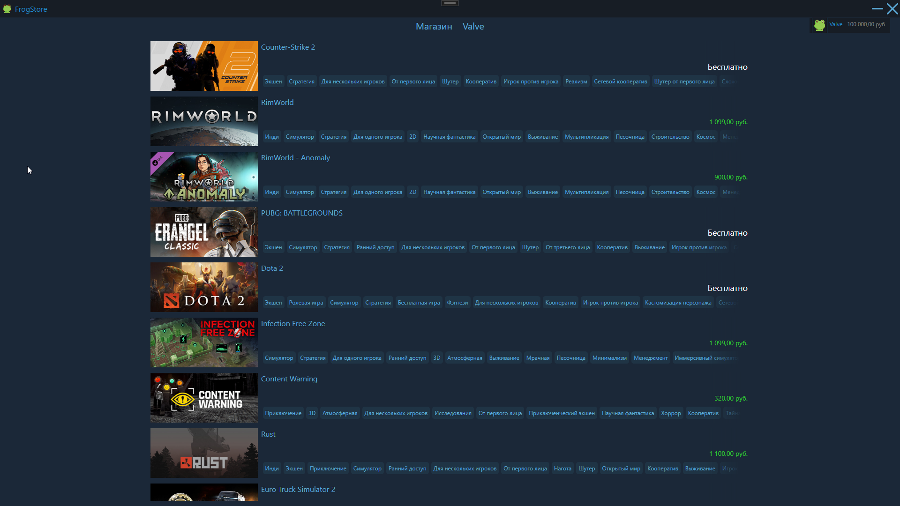
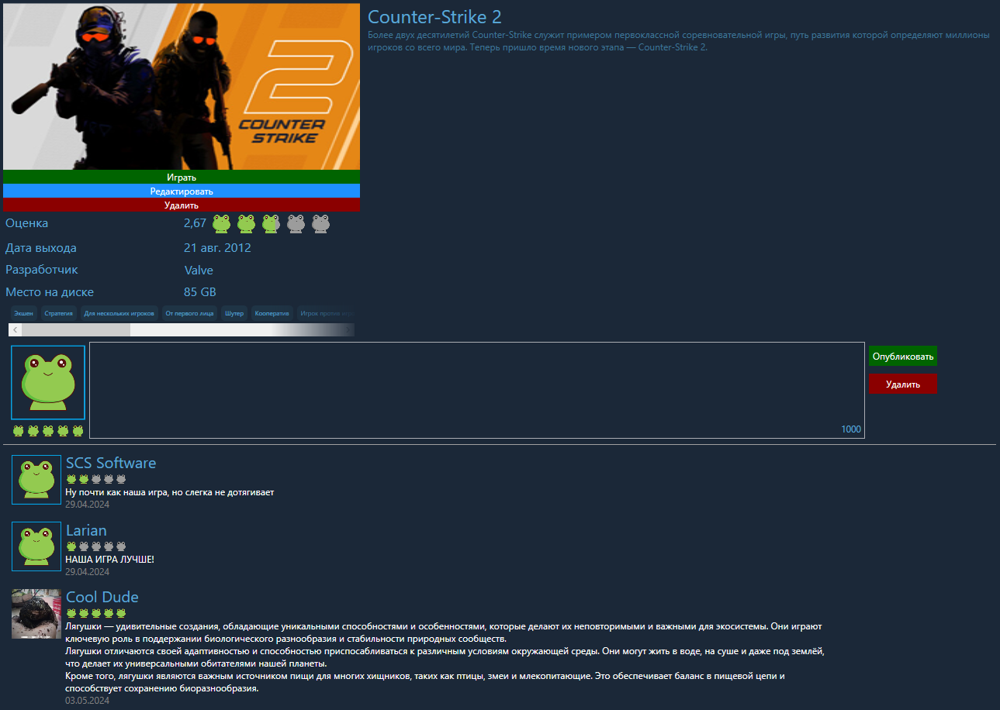
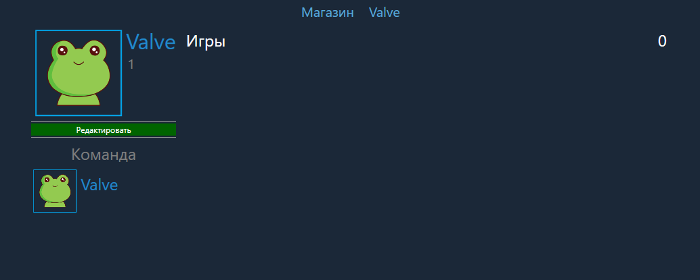
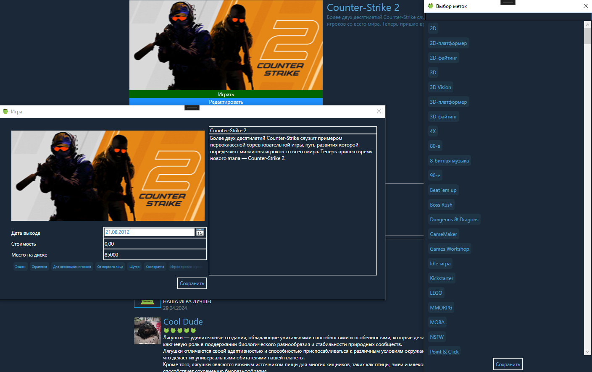
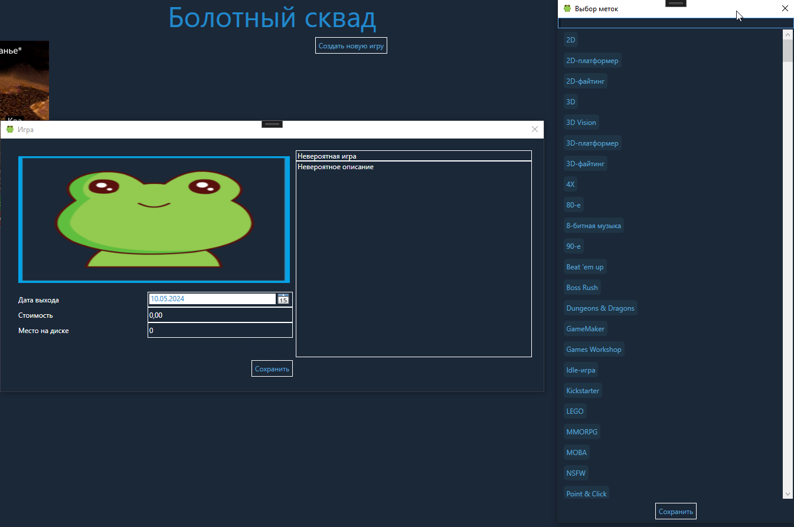
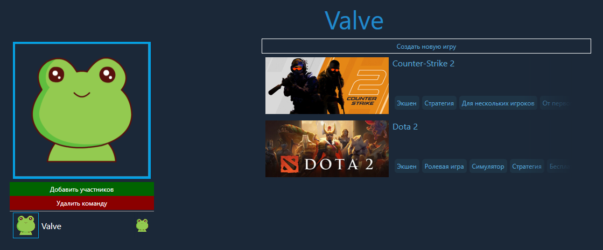
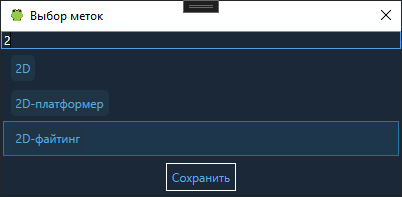

# GameStore

[](https://dotnet.microsoft.com/download/dotnet/8.0)
[](https://learn.microsoft.com/ef/core/releases/v8-0-4)
[](https://www.microsoft.com/sql-server/sql-server-2019)
[](https://learn.microsoft.com/dotnet/csharp/whats-new/csharp-12)

<br/>


[Полный отчёт](https://drive.google.com/file/d/1w5Xuyxq0U9rk5yr_9ukOFnEnZII7rm3n/view?usp=sharing)

---

## 🎮 О проекте

**GameStore** — десктопное приложение для магазина игр, разработанное в рамках курсовой работы. Приложение представляет собой онлайн-сервис цифрового распространения компьютерных игр, который исполняет роль средства технической защиты авторских прав и платформы для многопользовательских игр.

Приложение позволяет просматривать каталог игр с фильтрацией по меткам, изучать детальную информацию о каждой игре, читать отзывы и приобретать покупки. Пользователи могут создавать учётные записи, управлять личными данными и историей покупок, а также [запускать приобретённые игры](https://github.com/Terrarianec/GameStore/commit/b24ec29) из собственной библиотеки. Также реализован функционал для команд-разработчиков: создание и редактирование команд, публикация собственных игр и управление составом участников.

База данных спроектирована с учётом связей между пользователями, играми, метками, командами и отзывами, а для контроля прав доступа реализованы определяемые пользователем функции.

---

## 🏗️ Архитектура

Проект состоит из трёх слоёв, разделённых по назначению:

| Слой | Проект | Описание |
|---|---|---|
| 💾 **Данные** | `GameStore.DB` | EF Core-модели, контекст БД, отображение сущностей |
| 🔧 **Утилиты** | `GameStore.Utilities` | Вспомогательные функции и классы |
| 🖥️ **Презентация** | `GameStore.Presentation` | WPF-клиент с окнами, элементами управления и стилями |

---

## 📊 Модели данных

### ER-диаграмма



### Диаграмма базы данных



### Основные сущности

| Сущность | Описание |
|---|---|
| 👤 **User** | Пользователь: `Id`, `Username`, `Avatar`, `Login`, `PasswordHash`, `DateOfBirth`, `Balance` |
| 🎮 **Game** | Игра: `Id`, `Name`, `Logo`, `Description`, `Price`, `RequiredFreeSpace`, `PublishDate`, `TeamId` |
| 👥 **Team** | Команда-разработчик: `Id`, `Name`, `Logo`, `OwnerId` |
| 🤝 **Member** | Связь «пользователь ↔ команда» (таблица-пересечение) |
| 🏷️ **Tag** | Метка игры |
| 💬 **GameReview** | Отзыв: `UserId`, `GameId`, `Rate`, `Content`, `PublishDate` |

---

## 💻 Экраны приложения

### 🏠 Главное окно

Рабочая область приложения. Содержит список всех игр, панель навигации и быстрый доступ к профилю.



### 🎮 Карточка игры

Детальная информация о конкретной игре. Содержит описание, цену, обложку, отзывы и возможность покупки.



### 👤 Профиль пользователя

Управление личными данными пользователя: редактирование имени, загрузка изображения профиля, просмотр истории покупок и баланса.



### ✏️ Редактирование игры

Форма создания и редактирования информации об игре: название, описание, цена, размер, обложка, привязка к команде.



### ➕ Создание игры

Форма добавления новой игры в каталог с заполнением всех обязательных полей и привязкой к команде-разработчику.



### 👥 Команда-разработчик

Управление командой-разработчиком: название, логотип, владелец.



### 🏷️ Метки игр

Интерфейс выбора и управления метками для игр.



---

## 🗄️ База данных

### 🔗 Подключение

Строка подключения настроена в `GameStoreContext.OnConfiguring()`:

```
Server=localhost\SQLEXPRESS;encrypt=false;database=GameStore;user=исп-31;password=1234567890;
```

### 📥 Инициализация

Запустите скрипт **`sql/db.sql`** в **SSMS** или **Azure Data Studio** — он создаст базу `GameStore`, все таблицы, представления и определяемые пользователем функции, а также заполнит данными 16 игр и отзывы.

### ⚙️ SQL Server функции

Для проверок прав доступа используются пользовательские функции:

| Функция | Назначение |
|---|---|
| `IsOwnerOfTeam(@TeamId, @UserId)` | Является ли пользователь владельцем команды |
| `IsMemberOfTeam(@TeamId, @UserId)` | Является ли пользователь участником команды |
| `IsOwnerOfGame(@GameId, @UserId)` | Является ли пользователь владельцем игры |
| `IsDeveloperOfGame(@GameId, @UserId)` | Является ли пользователь разработчиком игры |
| `IsGamePurchased(@GameId, @UserId)` | Приобрёл ли пользователь игру |

### 📜 Дополнительные скрипты

| Скрипт | Описание |
|---|---|
| `BuyGame.sql` | Покупка игры |
| `TransferMoney.sql` | Перевод средств |
| `BalanceReplenishment.sql` | Пополнение баланса |
| `CreateTag.sql` / `DeleteTag.sql` | Добавление / удаление меток |
| `InsertGameTags.sql` | Привязка меток к играм |
| `ResetTags.sql` | Полный сброс меток |

---

## 🏃 Как запустить

### 📦 Требования

| Требование | Описание |
|---|---|
| **.NET 8.0 SDK** | Платформа для сборки и запуска |
| **SQL Server 2019** | СУБД для хранения данных |
| **Visual Studio 2022** / **VS Code + C# Dev Kit** | IDE для разработки |
| **SSMS 2018** | SQL Server Management Studio для работы с БД |

### 🚀 Запуск

```bash
dotnet build
dotnet run --project GameStore.Presentation
```

> ⚠️ Строка подключения в `GameStore.DB/GameStoreContext.cs` рассчитана на локальный SQL Server с именем `исп-31`. Перед запуском убедитесь, что БД создана через `sql/db.sql`, а параметры подключения соответствуют вашему окружению.

---

## 📂 Структура решения

```
GameStore/
├── GameStore.sln
├── GameStore.DB/           # слой данных и модели
├── GameStore.Utilities/    # вспомогательные функции
└── GameStore.Presentation/ # слой представления (WPF)
    ├── Windows/            # окна приложения
    │   ├── LoginWindow            # вход в систему («Выйти» в MainWindow)
    │   ├── RegisterWindow         # создание учётной записи («Ещё нет учётной записи?» в LoginWindow)
    │   ├── MainWindow             # главная оболочка приложения (открывается после входа)
    │   ├── GameWindow             # просмотр запущенной игры («Открыть» в GamePage)
    │   ├── EditProfileWindow      # редактирование профиля («Редактировать» в UserProfile)
    │   ├── EditGameWindow         # создание / редактирование игры («Редактировать» в GamePage, «Создать игру» в TeamPage)
    │   ├── EditTeamWindow         # создание / редактирование команды («Моя команда» в MainWindow, «Редактировать» в TeamPage)
    │   ├── AddMembersWindow       # добавление участников в команду («Добавить участников» в TeamPage)
    │   └── SelectGameTagsWindow   # выбор меток для игры («Выбрать метки» в EditGameWindow)
    ├── Pages/              # встраиваемые страницы в MainWindow
    │   ├── MainStorePage      # каталог игр («Магазин» в MainWindow)
    │   ├── GamePage           # страница игры (выбор игры из MainStorePage или UserProfile)
    │   ├── UserProfile        # страница пользователя («Профиль» в MainWindow, выбор пользователя в TeamPage)
    │   └── TeamPage           # страница команды («Моя команда» в MainWindow, выбор команды в GamePage или UserProfile)
    ├── Controls/           # пользовательские элементы управления
    │   ├── UploadImageArea  # загрузка изображения с превью (RegisterWindow, EditProfileWindow, EditGameWindow)
    │   ├── CaptchaBox       # простая капча (LoginWindow, RegisterWindow)
    │   └── RateView         # интерактивная оценка в виде лягушек (оценки в GamePage)
    └── Resources/           # изображения и другие ресурсы
```